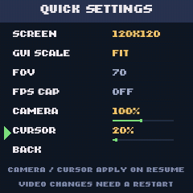

# NanoCraft

**Minecraft Pocket Edition 0.8.1 on the Anbernic RG Nano — and, since v1.0.12, on the FunKey S.**


*Not a mock-up. That is 0.8.1 running on the Nano at its native 240x240, drawn
entirely in software on one CPU core.*

> **No game files are included.** You supply your own official Minecraft Pocket
> Edition APK.
>
> **NOT AN OFFICIAL MINECRAFT PRODUCT. NOT APPROVED BY OR ASSOCIATED WITH
> MOJANG OR MICROSOFT.**

---

## This is Pocket Edition, not Bedrock — and that is the point

My two other ports run **Bedrock** on handhelds. On the RG Nano that barely
works: Bedrock 1.2.20.2 manages **2.2 fps** here and crashes reproducibly after
about 75 seconds.

NanoCraft runs **Pocket Edition 0.8.1** instead, a 2013 build with a fraction of
the engine cost. Same console, same software renderer:

| | Bedrock 1.2.20.2 | **Pocket Edition 0.8.1** |
| --- | ---: | ---: |
| In a world | 2.2 fps | **7.8 fps** |
| Resolution | 80x80, upscaled | **240x240 native** |
| Stability | crashes at ~75 s | stable |

0.8.1 is also the last version before infinite worlds, which is the version
worth having on a console like this.

## What performance to honestly expect

**Release audit, September 2026:** the v1.0.10 release archive shipped an older
runtime without the GUI-scale and FOV patches described below, so selecting FIT
could not fix anything — the binary had no code behind the setting. That is
corrected in the current build, and the packaging guard that would have caught
it now runs on every package. See the
[120x120 UI plan](docs/UI-120-PLAN.md) for the evidence and what followed.

The RG Nano has **no GPU at all** and **one** Cortex-A7 core at 1008 MHz. Every
pixel is drawn by a software rasterizer.

| Internal resolution | Frame rate | Picture |
| --- | ---: | --- |
| **120x120 — the default** | **11.9 fps** | soft 2x upscale, whole interface |
| 240x240 | 7.8 fps | native, 1:1, sharpest |

The default no longer costs a soft *interface*. At 120x120 the world renders at
120x120 and the hotbar, items, HUD and menus are drawn over it at the panel's
real 240x240, so only the world is upscaled. See
[docs/NATIVE-UI.md](docs/NATIVE-UI.md).

**Both figures are in-world**, measured by replaying a recorded real play session
against the same restored world — not by standing still on a title screen. A
title screen reads 11.6 fps at 240x240 and means nothing.

> **These numbers are from before v1.0.8 and now understate the port.** The
> launcher had been overriding the presenter's own documented default and
> enabling an asynchronous present path that cannot pay on a single core. With
> it off, a live session at 120x120 measured **12.9 → 14.9 fps median**, about
> +16%, with the readback dropping from 37.6 ms a frame to 0.4. The table below
> and the frame-time model that follows have not been re-measured on the replay
> rig, so treat them as a floor rather than as current.

**Why 120x120 is the default.** Quartering the pixel count buys +52%, not the
4x a fill-rate-bound workload would give, because about **70 ms of every frame
is fixed** — roughly 46 ms of Minecraft's own logic and 23 ms of rasterizer
overhead, neither of which cares about resolution:

```text
frame_ms  ~=  70.6  +  0.00094 x pixels
```

So resolution alone tops out near 14 fps no matter how far you drop it. +52% is
still the largest single gain available, though, and until v1.0.5 it came with a
hotbar cut off at both edges, which is why 240x240 was recommended instead. That
is fixed, so the trade is now four frames against a softer picture, and four
frames matter a great deal at eight.

**Prefer the sharper image?** 240x240 is one row away in the quick menu
(**L + SELECT → SETTINGS → SCREEN**), then RESTART to apply it — the game reads the
size once at startup, so it cannot change in a running process. Editing
`/mnt/FunKey/nanocraft/resolution.txt` does the same thing. Those two are the
only sizes that divide the panel cleanly; anything between them shimmers.

### GUI scale

120x120 used to cut the ends off the hotbar, which is the only reason it was not
the default. That was never a Minecraft setting going wrong: Ninecraft lays the
interface out at a scale it computes from the window and **floors that scale at
1.0**, and Minecraft's hotbar is 182 interface pixels wide, so a 120-pixel-wide
screen was simply 62 pixels too narrow for it.
Nothing in the game's own options could reach it — `gfx_pixeldensity`, despite
the name, is the touch d-pad's size in pixels per millimetre and is recomputed
from the window on every launch.

This port's launcher takes the scale from the environment and will go below that
floor. **SETTINGS → GUI SCALE**:

| | What it does |
| --- | --- |
| **FIT** (default) | Size the interface to the hotbar in either direction. At 120x120 that shrinks it to fit; at 240x240 it *grows* into the spare room. Never clipped at either, so it is the one setting that suits both screen sizes. |
| **AUTO** | Shrink only as far as the hotbar needs, and never grow. Identical to FIT at 120x120; leaves 240x240 exactly as older versions drew it. |
| **STOCK** | One interface pixel per rendered pixel, exactly as Ninecraft ships. Crispest, and clips at 120x120. |

Like SCREEN, it is read at startup, so it takes a RESTART.
`/mnt/FunKey/nanocraft/guiscale.txt` holds the same value.

### Field of view

**SETTINGS → FOV**, 50 to 100 degrees. **70 is what Minecraft ships with**, and
choosing 70 changes nothing at all.

Pocket Edition 0.8.1 has no FOV setting — its entire settings vocabulary is 21
keys and none of them is one. (`assets/lang/en_US.lang` does contain
`options.fov=FOV`, but that file is inherited desktop-Minecraft boilerplate; it
also offers 3D Anaglyph and warns you about 64-bit *Java* installs. A string
there is not evidence the game implements anything.)

What the engine does have is `GameRenderer::getFov()`, whose result
`setupCamera()` hands straight to `gluPerspective`, and whose base angle is a
single number sitting in the code. This port's launcher rewrites that one
number at startup. That is exactly what Minecraft's own FOV slider does, so the
sprint and low-health effects still apply on top of whatever you pick, and the
item in your hand keeps its own fixed angle — which is why it does not distort
when you go wide, the same as in vanilla.

A narrow angle magnifies distant things; a wide one shows far more around you
at the cost of stretching the edges. Neither is faster: the same world is drawn
either way. Read at startup, so it takes a RESTART, and
`/mnt/FunKey/nanocraft/fov.txt` holds the same value.

**8 fps is what this hardware does.** It is enough to build, explore and potter
about. It is not enough for combat.

### Overclocking, in the quick menu

It is the only lever left that attacks that fixed 70 ms, because all of it is
CPU time — and unlike dropping the resolution it costs **no picture quality**.

| Clock | 240x240 | 120x120 |
| --- | ---: | ---: |
| 1008 MHz (stock) | 7.8 fps | 11.9 fps |
| 1200 MHz | ~9.4 fps | ~14.2 fps |

**L + SELECT → CPU**, then left/right. 1008 to 1248 MHz in 48 MHz steps,
applied immediately. Measured here: a fixed workload runs in 1.34 s at stock and
1.11 s at 1200 MHz, a 1.21x speed-up against the 1.19x the clock ratio predicts.

**Read this before using it.** This SoC has **no thermal management and no
voltage control**, so nothing steps in to protect it and these are overclocks at
the stock voltage. The ladder stops at 1248 because the V3s is specified at
1.2 GHz; the tool refuses to go further. Every step was verified on one console
here — yours may differ. Nothing is written to storage: the clock lives in a
register, NanoCraft restores stock when you quit, and a reboot clears it
regardless. If the console locks up, power-cycle it and pick a lower step.

## What you need

- An **Anbernic RG Nano** or a **FunKey S**, running DrUm78's FunKey-OS build.
- About **300 MB free** on the card.
- **Your own Pocket Edition 0.8.1 APK**, 32-bit `armeabi-v7a`.

The two consoles are close relatives and the same package serves both. Every
performance figure below was measured on an RG Nano; the FunKey S has the same
SoC and the same amount of RAM, so expect the same, but nobody has measured it.

**If NanoCraft refuses to start**, it is almost certainly because your kernel is
not one the compressed-memory modules have been checked against — they are only
loaded into builds somebody has verified, since the loader's own test cannot
tell two differently configured kernels apart. The launcher writes
`nanocraft-kernel.txt` to the root of your card when that happens; send it and
your console can be added. That is exactly how the FunKey S came to be
supported, and it needed no new modules at all — only checking. The working is
published in [docs/kernel-audits/](docs/kernel-audits/).

## Play used to crash on every console but mine. Here is why

A **FunKey S** owner reported this against v1.0.0:

> main menu works, options menu works, **Play crashes to desktop**

It was reproduced on a factory RG Nano and fixed in v1.0.7. The cause turned out
to have nothing to do with memory, graphics or the game files:

**Pressing Play opens the world list, and 0.8.1 answers that by asking RakNet to
broadcast for LAN games. On a console with no network interface at all, that
faults.** The crash is a null dereference inside
`RakNet::RakPeer::Ping(char const*, unsigned short, bool, unsigned int)`, about
eight seconds after the button, and the console is left showing the last frame
it drew — which reads as a freeze, because nothing repaints afterwards.

It never happened here because **this console has a WiFi dongle**, added for an
unrelated project. That single difference hid the bug through seven releases:
every console without a network — a stock RG Nano, a FunKey S — hit it every
time, and the one it was developed on never did.

The fix is three lines in the launcher: bring up loopback before starting the
game. `lo` exists on every kernel, costs nothing, and gives the socket layer
something real to answer with. Nothing else was needed.

### How it was found, since the false trails are instructive

Four explanations were built and discarded first — memory pressure, a SIGUSR1
kill, a thread deadlock, and world generation. Each was wrong the same way:
inferred from instrumentation that had not been verified.

The specific trap was the exit code. `run.sh` reported `status=138` on every
run, which is SIGUSR1 — but that number came from the launcher's own `wait`
being interrupted by the power button, not from the game. The real status was
never being recorded. Capturing it from outside the launcher's signal handling
gave `139` on the first try, the kernel's fatal-signal dump gave the faulting
address, and the memory map resolved it to a symbol immediately.

The lesson worth keeping: **`139` is a segfault and `138` was an artifact.**
Since v1.0.7 the log says `game ended on its own, status=N` or `game closed from
the menu`, so the two can never be confused again.

### Ruled out along the way: the APK

An early guess was that the reporter had a different build of 0.8.1, because
Ninecraft reads the game's C++ objects at hard-coded byte offsets validated
against one specific library. **That guess was wrong.** Both 0.8.1 APKs from the
archive.org set contain a `libminecraftpe.so` byte-identical to the tested one:

```text
libminecraftpe.so   9,668,996 bytes
sha256              baf9ca243fa301b7a9b4755ddc97aba1f0d35c9b1b80479980b47d6455a32677
```

The installer still records that size and sha256 into `install.log`, because
ruling this out in one line is worth the second it costs.

### What is measured, and what shipped

Measured in a world, on two different consoles:

| | development console | factory console |
| --- | ---: | ---: |
| Game resident | 28 MB | 42 MB |
| Held compressed | 37 MB | 36 MB |
| **Total anonymous** | **65 MB** | **65 MB** |
| RAM the console has | 56 MB | 54 MB |
| Free at the worst moment | 3.9 MB | 4.2 MB |

**Entering a world needs about 10 MB more anonymous memory than this hardware
physically has**, and since v1.0.6 that difference is found in RAM rather than
on your card. The launcher loads zram and LZ4 holds those pages at a measured
**2.7:1**, so roughly 36 MB of idle pages occupy about 13 MB. Nothing is written
to the SD card at any point. Details in [docs/PORTING.md](docs/PORTING.md).

That ~4 MB floor is the budget this port lives inside, and it is why you will
feel occasional stalls: a page the game touches that lives in zram has to be
decompressed on the same core that draws the frame.

**The one thing that may not travel is the kernel modules.** The RG Nano's
kernel has no zram, so NanoCraft ships its own — and a kernel module is built
for one specific kernel. Two sets ship, for the factory image and for a
uniprocessor custom build, and `opk/modules/kernels` lists which builds have
actually been verified. On anything else NanoCraft says so and refuses to start
rather than run without the memory it needs. Rebuilding for your kernel needs no
firmware change and is documented in
[`opk/modules/README.md`](opk/modules/README.md); it writes **`nanocraft-kernel.txt`** to the root of your SD card with
everything needed to build you one — send that single file.

### If it fails for you, there is a diagnostic build

**`NanoCraftDiag_funkey-s.opk`** on the
[releases page](https://github.com/DankMiimer/nanocraft/releases/latest) answers
most of the questions in one run, so nobody has to be asked the same thing five
times. It records the console, probes how much memory a process can really
obtain, runs the game normally, and — the useful part — turns on the kernel's
fault reporting first and captures the game's memory map while it lives, so any
crash address can be **resolved to the library that faulted and the offset
inside it**.

It writes `nanocraft-report.txt` to the **root of the SD card** and **sends
nothing** — the packaging script refuses to build it if any network code
appears. These consoles have no networking, so the card is how the file
travels, and the root is where you will actually find it. Full instructions in
[INSTALL.md](INSTALL.md).

## Install

See **[INSTALL.md](INSTALL.md)**. In short: copy the `.opk` into
`/mnt/Native games/`, extract the payload into `/mnt/FunKey/nanocraft/`, drop
your APK in `/mnt/FunKey/nanocraft/apk/`, and launch. The first run installs the
game from your APK by itself.

## Controls

The Nano has no second stick, so **the four face buttons are the right stick**,
and **L is the modifier** for everything else.

| Input | Action |
| --- | --- |
| D-pad | move |
| X / B / Y / A | look up / down / left / right |
| **R** | break block — also *click* in menus |
| **L + X** | place block |
| **L + Y** | inventory |
| **L + A** | jump |
| **L + B** | crouch |
| **L + START** | start menu |
| START | hotbar right |
| SELECT | hotbar left |
| **L + SELECT** | quick menu |
| hold MENU 2 s | quit |

Looking accelerates: a tap nudges the camera, holding speeds it up.

## The quick menu


**L + SELECT** brings it up. D-pad to move, left/right to change a value, A to
pick, B to go back.

| Row | What it does |
| --- | --- |
| VOLUME / BRIGHT | adjust, immediately |
| **CPU** | 1008 – 1248 MHz in 48 MHz steps, **applies at once** |
| **SETTINGS** | opens SCREEN, GUI SCALE, FOV, FPS CAP, CAMERA and CURSOR |
| RESTART | relaunch the game, which is how a video change is applied |
| **FORCE CLOSE** | kills the game — see below |
| SHUTDOWN / RESUME | leave |

Quick Settings separates changes that need a restart from sensitivity changes
that apply when you resume:

| Row | What it does |
| --- | --- |
| **SCREEN** | 240x240 or 120x120 — **needs a restart** |
| **GUI SCALE** | AUTO, FIT or STOCK — **needs a restart**. See [GUI scale](#gui-scale) |
| **FOV** | 50 to 100 degrees, 70 is stock — **needs a restart**. See [Field of view](#field-of-view) |
| **FPS CAP** | OFF or a frame-rate limit — **needs a restart** |
| **CAMERA** | 10–200%, in 10% steps; defaults to **100%**, preserving the existing camera speed |
| **CURSOR** | 10–200%, in 10% steps; defaults to **20%** for slower menu navigation |
| BACK | to the main list; B does the same |



Camera and cursor values persist together in
`/mnt/FunKey/nanocraft/sensitivity.txt` as `100 20` (camera, then cursor).
Left/right adjusts the selected slider; changes apply within half a second of
resuming. The cursor uses the same fraction of the screen per second at 120x120
and 240x240. Its percentage refers to the previous 240-pixel baseline; at
120x120 the default is one tenth of the previous unscaled cursor speed.
Camera movement uses its own multiplier and leaves Minecraft's
`ctrl_sensitivity` setting alone. Missing or invalid files use the defaults.

The native quick menu draws at the panel's 240x240 resolution independently
of the game's selected render resolution. The preview above comes from its
actual drawing code in a test framebuffer, not a capture from the console.

**FORCE CLOSE is named for what it does.** It sends `SIGTERM` and then `SIGKILL`,
so anything since Minecraft's last autosave is lost. To quit with a save, use
the game's own pause menu (**L + START**) and leave the world from there.
RESTART and SHUTDOWN close the game the same way, so the same applies.

This exists because on this OS **the power menu is drawn by whatever app is in
the foreground**, not by the system — so a game either provides one or you get
nothing. The menu freezes the game while it is open, which is why it can draw
over it at all.

## Things worth knowing

**No audio.** The game runs on SDL's dummy audio driver. Sound is untested.

**Crafting is not bound.** In this engine jump, crouch, inventory and craft all
live on the same modifier, and `L+X` is spent on place-block. Inventory is the
more useful of the two screens on a console this size.

**LAN multiplayer appears to work.** With another 0.8.1 console on the same
wifi, its world showed up in the list. Not tested beyond that, and not a feature
claim.

**A frozen picture usually means the game exited**, not that it hung — nothing
else redraws the screen afterwards.

## How it works

The interesting part is that **nothing was recompiled for this console.**

- **The RG Nano is a musl system; the launcher is a glibc binary.** Rather than
  port it, NanoCraft ships Debian Buster's glibc and *invokes the bundled loader
  explicitly* — `ld-linux-armhf.so.3 --library-path … ./ninecraft`. Unlike
  patching `PT_INTERP`, this survives the install directory being moved.
- **Software OpenGL via Mesa llvmpipe**, blitted to `/dev/fb0` as RGB565 by a
  small presenter written for this port. llvmpipe measured **3.7x faster than
  softpipe** here — the opposite of what the port plan assumed.
- **Controls are remapped at the GPIO source.** The binary expects a *different
  console's* key codes, so instead of rebuilding it, `fkgpiod` is told to emit
  those codes. Zero runtime cost.

Full engineering write-up: **[docs/PORTING.md](docs/PORTING.md)**.

## Building it yourself

The build recipes ship in [`build/`](build/) — the Dockerfiles and the Ninecraft
patch — so what you are running can be reproduced. A verified step-by-step build
guide is not written yet.

## How much of this was written by AI

Most of it, and you should know that before you run it on your own hardware.

NanoCraft was built with AI coding assistants — Claude and ChatGPT — working
from my direction. That covers the launcher scripts, the framebuffer presenter,
the quick menu, the packaging, the zram work, and most of the documentation in
this repository including this README. The write-ups in `docs/` started life as
notes one agent left for the next, which is why they read the way they do.

What it does not cover is the hardware. **Every performance and memory figure
here was measured on a physical RG Nano**, not estimated and not produced by a
model, and every feature was tried on the console before it was described as
working. The frame rates, the 2.7:1 compression ratio, the memory floor during
world entry — those came off the device. Where something is unmeasured or
untested, the text says so rather than rounding it up into a claim.

I chose the approach, ran the console, decided what shipped, and the mistakes in
it are mine. I am saying this plainly because "an AI wrote it" is worth knowing
when you are deciding whether to trust software with your SD card, and finding
it out later is worse than being told.

## Legal

NanoCraft distributes launcher scripts, a framebuffer presenter, a quick menu and
a software OpenGL stack. **No Minecraft APKs, game libraries, assets or worlds
are included, and none ever will be.** You supply your own legally obtained copy.

Nothing here mirrors or hosts game files, defeats a protection measure, or
provides any way to obtain Minecraft without owning it.

See [LEGAL.md](LEGAL.md), [THIRD_PARTY_NOTICES.md](THIRD_PARTY_NOTICES.md) and
[TRADEMARKS.md](TRADEMARKS.md).

## Credits

- **[Ninecraft](https://github.com/MCPI-Revival/Ninecraft)** (MIT) — the launcher
  this port patches and ships. It does the hard part.
- **[Mesa](https://www.mesa3d.org/)** — llvmpipe and OSMesa, doing all the drawing.
- **[DrUm78's FunKey-OS](https://github.com/DrUm78/FunKey-OS)** — the RG Nano OS,
  its `fkgpiod` remapping and GMenu2X.

## My other Minecraft handheld ports

- **[minecraft-bedrock-miyoo-mini-plus](https://github.com/DankMiimer/minecraft-bedrock-miyoo-mini-plus)**
  — Bedrock 1.2.20.2 on the Miyoo Mini Plus. NanoCraft's client, Mesa build and
  EGL shim all come from there.
- **[minecraft-bedrock-handheld-port](https://github.com/DankMiimer/minecraft-bedrock-handheld-port)**
  — the RG34xxSP / PortMaster port.
- **[mcbedrock-get](https://github.com/DankMiimer/mcbedrock-get)** — a helper for
  downloading your own Bedrock APK. Bedrock only; NanoCraft needs a Pocket
  Edition APK instead.
